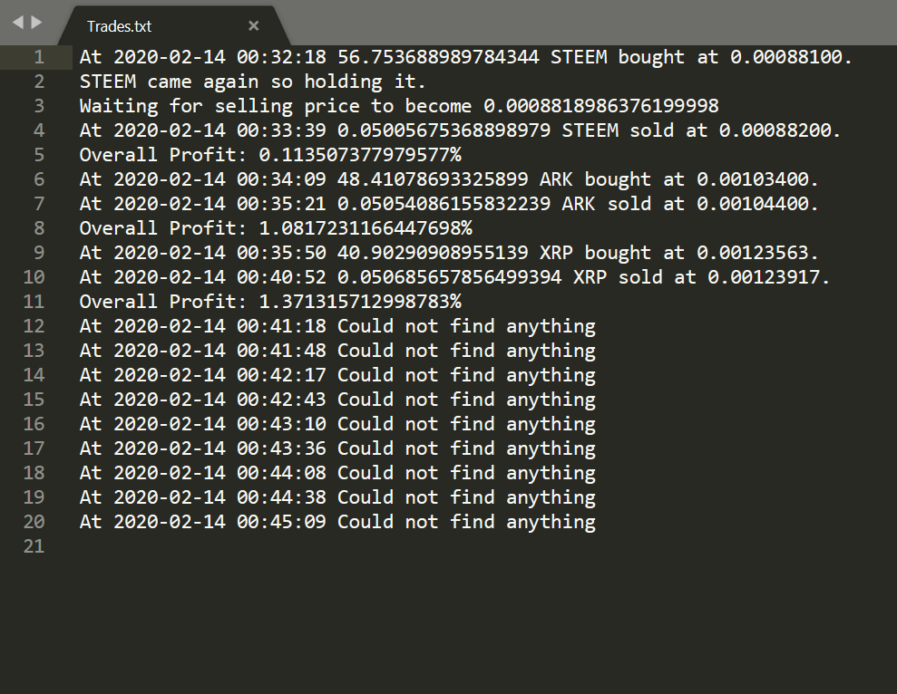

# Crypto-Trading-Bot

This project was aimed to create a cryptocurrency trading bot by real-time simple technical analysis at Binance exchange. 

Currently, it is doing paper trading. Different screens are available to shortlist a coin to buy. Screens are designed based ib on some price movements
and technical indicators. The work on this project was started in the first half of 2018 and completely stopped after a few months, when 
The government of India started implementing strict policies about cryptocurrency trading.

For technical functions like Bollinger bands, average true range, relative strength index, etc pyti is used. 
For Moving average convergence divergence functions have been created.

# Running Bot

* Open myBot.py
* From all the available screens import any screen in line 2 of the code.
* Run myBot.py
* Trades.txt will be created in the same directory which will record trades. Currently, it is just doing paper trading by fetching the information from 
  an exchange and doing the technical analysis. 
  
  
